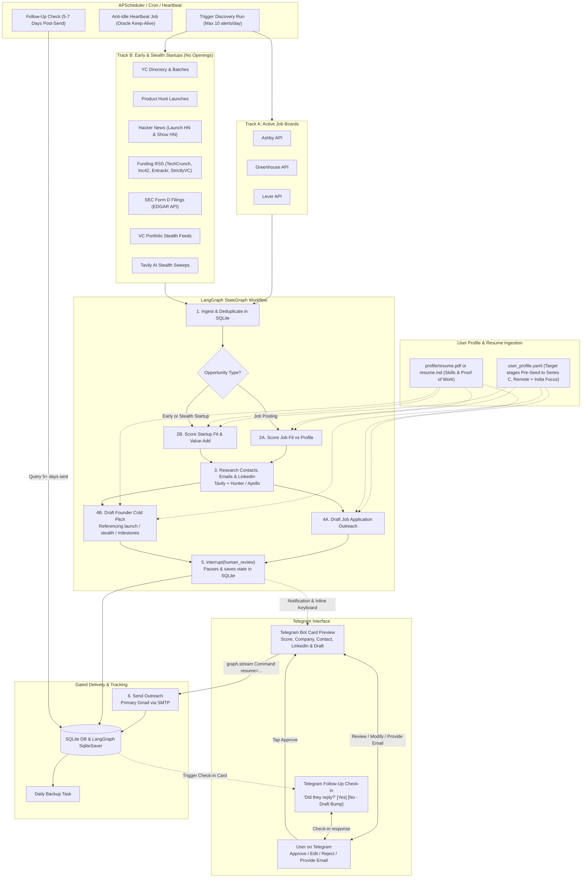

# System Architecture & Technical Design

A personal, cloud-AI-powered autonomous outreach system that discovers promising startups and job openings, evaluates fit against your profile, discovers founder/hiring contacts, drafts hyper-personalized outreach, and requires your explicit approval via Telegram before sending.

---

## 1. System Overview & Principles

1. **Precision Over Volume**: Max 10 highly curated alerts per day rather than generic mass cold emailing.
2. **Strict Human Gate**: The email delivery tool is isolated outside the autonomous agent's toolset. It only executes when you explicitly tap `[ ✅ Approve & Send ]` on Telegram via `Command(resume=...)`.
3. **Dual-Track Discovery**:
   - **Track A (Active Job Openings)**: Ashby, Greenhouse, Lever.
   - **Track B (Early Startups & Launches — No Job Openings)**: YC Batches, Product Hunt Launches, Hacker News (`Launch HN`/`Show HN`), Funding RSS (TechCrunch, Inc42, Entrackr), SEC Form D filings, VC stealth additions, and Tavily search sweeps.
4. **Zero Inbound Port Requirement**: Uses Telegram Long-Polling (`getUpdates`), making only outbound HTTPS requests. Runs securely behind any home router, firewall, or cloud security list without port forwarding or public domain setup.
5. **Oracle Cloud Free Tier Ready**: Multi-arch Docker (`amd64`/`arm64`) with persistent SQLite volume and an anti-idle heartbeat cron job.

---

## 2. End-to-End Architecture Diagram

---

## 3. Core Technical Stack

- **Runtime & Orchestration**: Python 3.11+, LangGraph `StateGraph`, `SqliteSaver` checkpointer.
- **AI Gateway**: **OpenRouter API** (`https://openrouter.ai/api/v1` - OpenAI-compatible interface).
  - Fast extraction/classification model: `deepseek/deepseek-chat` (or `google/gemini-2.0-flash-001`)
  - Deep scoring & drafting model: `deepseek/deepseek-chat` (or `anthropic/claude-3.5-haiku` / `meta-llama/llama-3.3-70b-instruct`)
- **Web & Search**: `httpx`, `beautifulsoup4`, `feedparser`, Tavily API.
- **Enrichment**: Hunter.io / Apollo free tier + Tavily Search.
- **Database**: SQLite with WAL mode (`data/outreach.db`).
- **Telegram Bot**: `python-telegram-bot` in long-polling mode (`getUpdates`).
- **Email Delivery**: Primary Gmail via SMTP (TLS / SSL with App Password).
- **Scheduling**: APScheduler (Discovery, Follow-up checker, Anti-idle heartbeat, DB backups).
- **Server**: FastAPI with Uvicorn (Healthcheck and manual trigger API).
- **Deployment**: Multi-arch Docker (`amd64`/`arm64`) + Docker Compose / Systemd.
